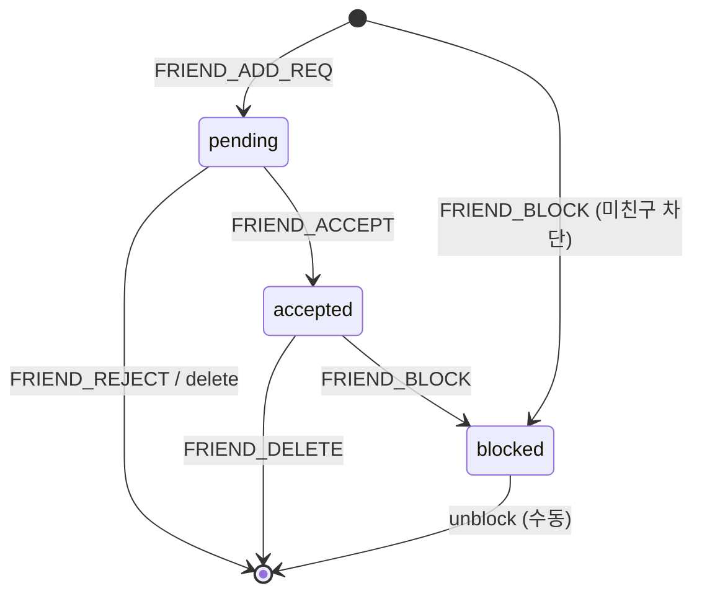

# 친구 관리 (FR-F01 ~ F07)

카카오톡 스타일의 양방향 친구 관계. `friends` 테이블은 `(user_id, friend_id)` 페어를 저장하며, 양방향 표현을 위해 **양쪽에 두 레코드**를 삽입한다(accepted 시).

## 상태 모델

`status`: 0=pending, 1=accepted, 2=blocked.

## FR-F01 친구 추가 · P1

| 패킷 | `FRIEND_ADD_REQ` / `FRIEND_ADD_RES` + 상대방에게 `FRIEND_REQUEST_NOTIFY` |
| 로직 | ① 대상 존재 확인 → ② 이미 친구/차단 검사 → ③ `INSERT friends(user_id=나, friend_id=상대, status=0)` → ④ 상대가 접속 중이면 실시간 notify |
| 응답 코드 | 0=SENT, 1=NOT_FOUND, 2=BLOCKED, 3=ALREADY_FRIEND |

## FR-F02 수락/거절 · P1

| 패킷 | `FRIEND_ACCEPT` / `FRIEND_REJECT` |
| 수락 | 기존 pending 레코드를 `accepted` 로 변경 + **역방향** `(friend, user)` 를 `accepted` 로 insert |
| 거절 | pending 레코드 삭제 |

## FR-F03 친구 목록 조회 · P1

| 패킷 | `FRIEND_LIST_REQ` / `FRIEND_LIST_RES` |
| 쿼리 | `SELECT u.id, u.nickname, u.online_status, u.status_msg FROM friends f JOIN users u ON f.friend_id=u.id WHERE f.user_id=? AND f.status=1` |

## FR-F04 친구 삭제 · P1

| 패킷 | `FRIEND_DELETE` |
| 로직 | 양방향 두 레코드 모두 DELETE |

## FR-F05 친구 차단 · P1

| 패킷 | `FRIEND_BLOCK` |
| 로직 | `UPDATE ... SET status=2`. 이후 해당 대상에서 DM/친구추가/룸초대 요청은 서버에서 차단 |

## FR-F06 온라인 상태 표시 · P1

| 규칙 | `online_status`: 0=OFF, 1=ON, 2=BUSY. `invisible` 은 DB 에 2 가 아닌 값으로 저장하지 않고, **응답 시 0 으로 위장**(설계 결정) |

## FR-F07 유저 검색 · P1

| 패킷 | `USER_SEARCH` / `USER_SEARCH_RES` |
| 쿼리 | `SELECT id, nickname, status_msg FROM users WHERE id LIKE ? OR nickname LIKE ? LIMIT 30` |
| 제한 | 키워드 2자 이상. 검색 결과 최대 30개 |

## 관련 문서

- 패킷: [`08_api/packets/friend.md`](../08_api/packets/friend.md)
- 테이블: [`07_database/tables/friends.md`](../07_database/tables/friends.md)
