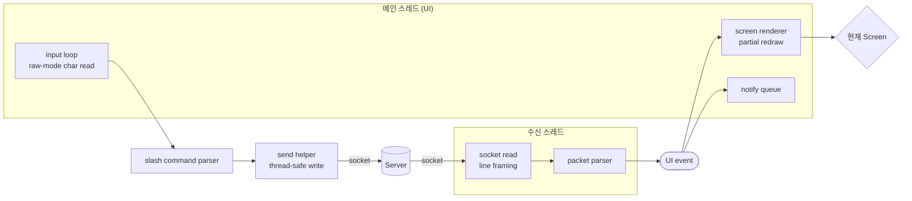
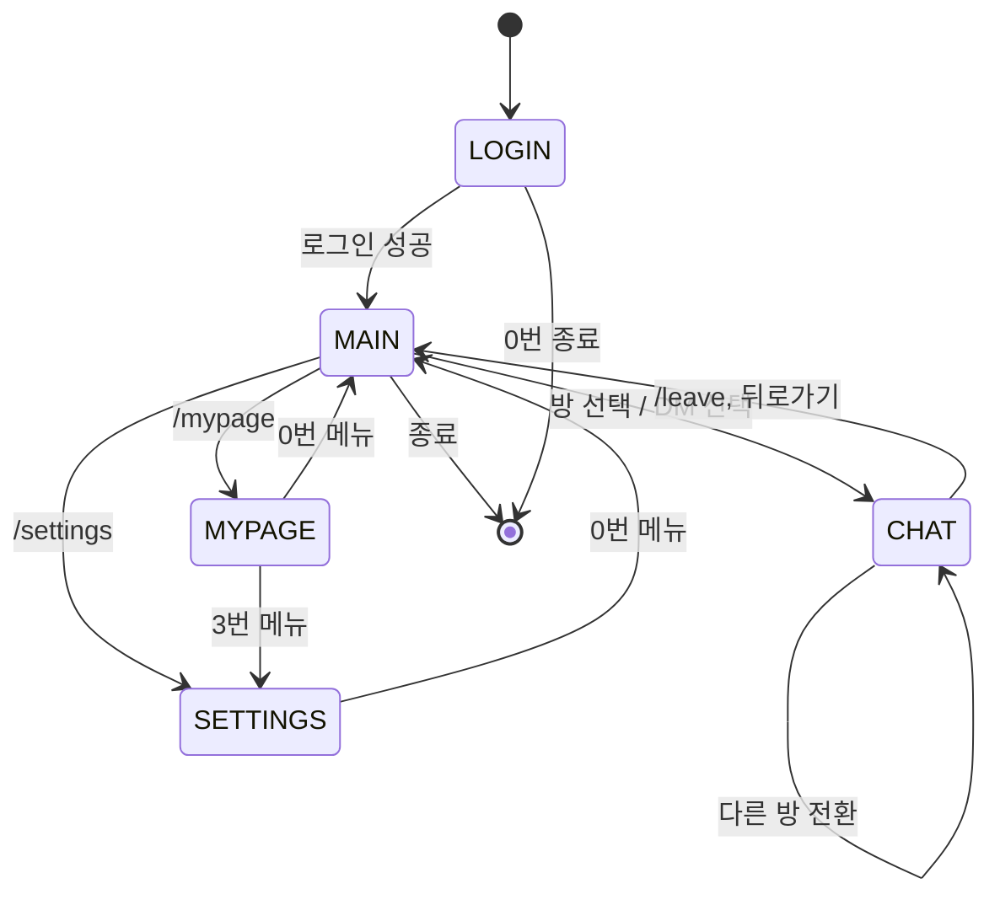

# 클라이언트 컴포넌트

## 1. 스레드 구조

## 2. 화면 상태 기계

## 3. 모듈별 책임

| 모듈 | 책임 |
|------|------|
| `main.c` | 인자 파싱, 연결 생성, 루프 진입 |
| `state.c/h` | 전역 클라이언트 상태(소켓 fd, 현재 스크린, 내 정보, 설정) |
| `net.c/h` | 소켓 연결, recv 스레드 본체, thread-safe send |
| `console.h` | 플랫폼 추상: `con_raw_on/off`, `con_getch`, `con_size`, `con_clear` |
| `ui.c/h` | ANSI 색상/박스 드로잉/커서 제어 헬퍼 |
| `input.c/h` | char 단위 입력 버퍼, 슬래시 커맨드 파서 |
| `notify.c/h` | 알림 큐, TTL, 상단 배너 렌더 |
| `screen_login.c` | 로그인/회원가입 화면 |
| `screen_main.c` | 메인 탭(친구/채팅/오픈채팅/마이페이지) |
| `screen_chat.c` | 채팅 화면 + 메시지 링버퍼 |
| `screen_mypage.c` | 마이페이지 |
| `screen_settings.c` | 설정 |

## 4. 렌더링 원칙

- **전체 재그리기 금지**(저사양 대응). 각 스크린은 `render_full()`(진입 시 1회) 과 `render_patch(event)`(이벤트 단위)를 분리.
- 메시지 링버퍼: `#define CHAT_VIEW_CAP 200`. 넘치면 가장 오래된 것 drop.
- 수신 스레드는 **렌더하지 않음** — 이벤트만 큐잉. 렌더는 UI 스레드에서만.

## 5. 스레드 안전

- 수신 스레드 → UI 스레드 전달: 단일 producer / 단일 consumer 링버퍼 + condvar.
- `send()` 는 단일 뮤텍스(`tx_mutex`)로 직렬화.
