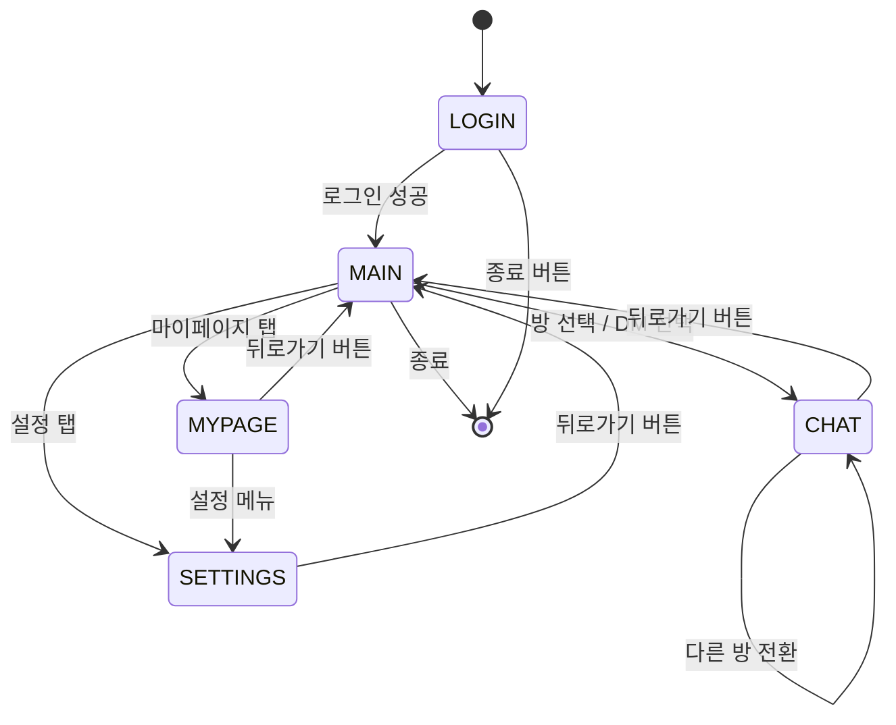

# 클라이언트 컴포넌트

## 1. 스레드 구조

```mermaid
flowchart LR
    subgraph Main["GTK 메인 스레드 (GtkApplication 이벤트 루프)"]
        INP[GTK 위젯 이벤트\n시그널 핸들러]
        RND[GTK 위젯 업데이트\ng_idle_add 콜백]
        NTF[알림 콜백]
    end
    subgraph Recv["수신 스레드"]
        RX[socket read\nline framing]
        PRS[packet parser]
    end
    TX[send helper\nthread-safe write]

    INP --> CMD[GTK 시그널 핸들러]
    CMD --> TX
    TX -- socket --> Server[(Server)]
    Server -- socket --> RX
    RX --> PRS --> UiEvent([g_idle_add() 콜백])
    UiEvent --> RND
    UiEvent --> NTF
    RND --> Screen{현재 GtkStack 페이지}
```

## 2. 화면 상태 기계



## 3. 모듈별 책임

| 모듈 | 책임 |
|------|------|
| `main.c` | 인자 파싱, `GtkApplication` 생성, 이벤트 루프 진입 |
| `state.c/h` | 전역 클라이언트 상태(소켓 fd, 현재 스크린, 내 정보, 설정) |
| `net.c/h` | 소켓 연결, recv 스레드 본체, thread-safe send |
| `app_window.c/h` | `GtkApplicationWindow` 생성, 위젯 계층 조립, `GtkStack` 페이지 전환 |
| `notify.c/h` | 알림 콜백, TTL, `GtkOverlay` 배너 렌더 |
| `screen_login.c` | 로그인/회원가입 화면 (`GtkGrid` + `GtkEntry` + `GtkButton`) |
| `screen_main.c` | 메인 탭(`GtkNotebook`: 친구/채팅/오픈채팅/마이페이지) |
| `screen_chat.c` | 채팅 화면(`GtkScrolledWindow` + `GtkTextView`) + 메시지 링버퍼 |
| `screen_mypage.c` | 마이페이지 |
| `screen_settings.c` | 설정 |

## 4. 위젯 계층 구조

```
GtkApplicationWindow
├── GtkHeaderBar (상단 바: 타이틀, 뒤로가기 버튼)
└── GtkStack (화면 전환: login / main / chat / mypage / settings)
    ├── 로그인 페이지: GtkGrid
    │     ├── GtkEntry (아이디)
    │     ├── GtkEntry (비밀번호)
    │     ├── GtkButton (로그인)
    │     └── GtkButton (회원가입)
    ├── 메인 페이지: GtkPaned
    │     └── GtkNotebook 사이드바 (친구 / 채팅 / 오픈채팅 / 마이페이지 탭)
    └── 채팅 페이지:
          ├── GtkScrolledWindow + GtkTextView (메시지 목록)
          ├── GtkEntry (메시지 입력)
          └── GtkButton (전송)
```

## 5. 렌더링 원칙

- GTK 위젯은 메인 스레드에서만 조작한다.
- 수신 스레드에서 UI 갱신이 필요한 경우 `g_idle_add()` 로 콜백을 메인 스레드에 예약한다.
- 메시지 링버퍼: `#define CHAT_VIEW_CAP 200`. 넘치면 가장 오래된 것 drop.
- 수신 스레드는 **위젯을 직접 수정하지 않음** — `g_idle_add()` 콜백만 등록.

## 6. 스레드 안전

- **GTK 단일 스레드 원칙**: 모든 위젯 조작은 GTK 메인 스레드에서만 수행해야 한다.
- 수신 스레드 → GTK 메인 스레드 전달: `g_idle_add()` 사용.
- `send()` 는 단일 뮤텍스(`tx_mutex`)로 직렬화.
