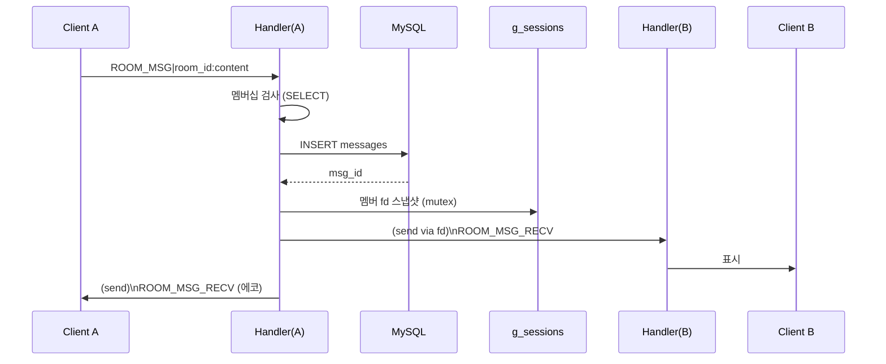
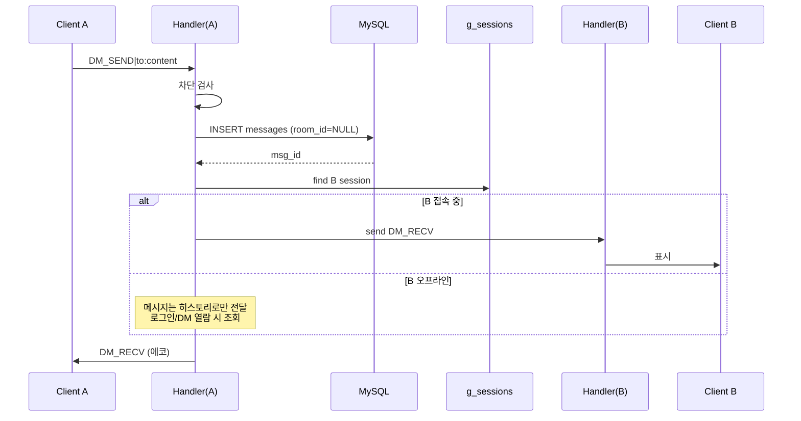
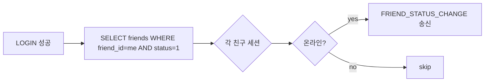

# 데이터 흐름

## 1. 방 메시지 전송

**순서 결정**: `INSERT → 멤버 fan-out` (DB 저장 완료 후 전달). 이 순서는 "삭제된 메시지 먼저 브로드캐스트되는" 레이스를 방지한다. NFR-02 50ms 는 로컬 기준이므로 DB 왕복 포함해도 달성 가능.

## 2. DM 전송

## 3. 친구 상태 변경 전파

로그인 시 친구 목록을 조회하고, **각 친구의 세션에 `FRIEND_STATUS_CHANGE` 송신**. 로그아웃 시도 동일.

## 4. 알림 전달 규칙 요약

| 이벤트 | 대상 | 억제 조건 |
|--------|------|-----------|
| 방 메시지 | 방 멤버 중 접속 & `current_room_id != 해당 방` | DND, room mute |
| 멘션 | 멘션된 유저 | **억제 없음** |
| DM 수신 | 수신자 | DND |
| 친구 요청 | 수신자 | 없음 |
| 서버 공지 | 전체 | 없음 |
