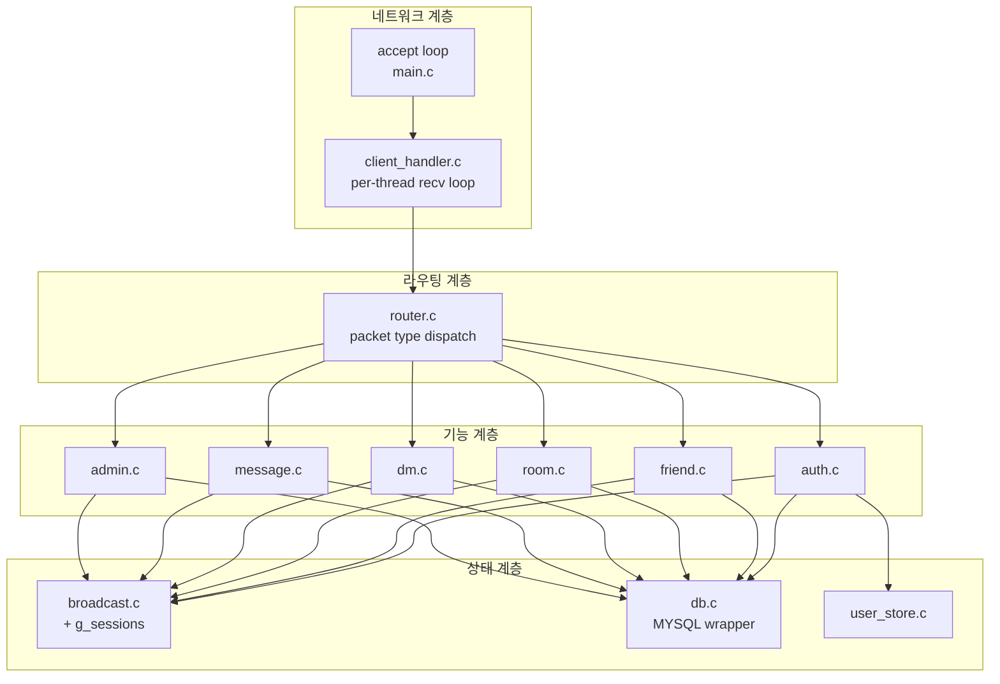

# 서버 컴포넌트

## 1. 계층 구조

## 2. 모듈별 책임

| 모듈 | 책임 | 주요 함수 |
|------|------|-----------|
| `main.c` | 소켓 bind/listen, accept loop, 시그널 셋업 | `main()`, `setup_signals()` |
| `globals.c/h` | 전역 세션 배열, mutex 정의 | `g_sessions[]`, `g_sessions_mutex` |
| `client_handler.c/h` | 클라이언트별 스레드 진입점, 패킷 라인 읽기 | `client_thread()`, `read_packet()` |
| `router.c/h` | `TYPE` 문자열 → 핸들러 함수 포인터 매핑 | `router_dispatch()` |
| `db.c/h` | MYSQL 연결 생성/해제, prepared stmt 헬퍼 | `db_connect()`, `db_exec()`, `db_query()` |
| `auth.c/h` | 회원가입, 로그인, 로그아웃, 비밀번호 변경 | `handle_register`, `handle_login`, ... |
| `user_store.c/h` | 유저/설정 CRUD | `user_find_by_id`, `settings_get`, `settings_update` |
| `friend.c/h` | 친구 요청/수락/차단/목록/검색 | `handle_friend_*` |
| `room.c/h` | 방 CRUD, 참여/퇴장/권한/공지 | `handle_room_*` |
| `dm.c/h` | DM 송신·히스토리·읽음 | `handle_dm_*` |
| `message.c/h` | 메시지 저장·삭제·수정·답장·검색 | `handle_msg_*` |
| `broadcast.c/h` | 방/서버 전체 fan-out, 알림 송신 | `bcast_room()`, `notify_user()` |

## 3. 공통 규약

- 모든 핸들러는 `(ClientSession *self, const char *payload) → int` 시그니처.
- 반환값: 0=정상, 음수=세션 종료 필요, 양수=경고 로그만.
- **응답 송신은 핸들러 내부에서**. 라우터는 응답을 만들지 않는다.
- DB 접근은 반드시 `self->db` 사용(스레드 전용 연결).
