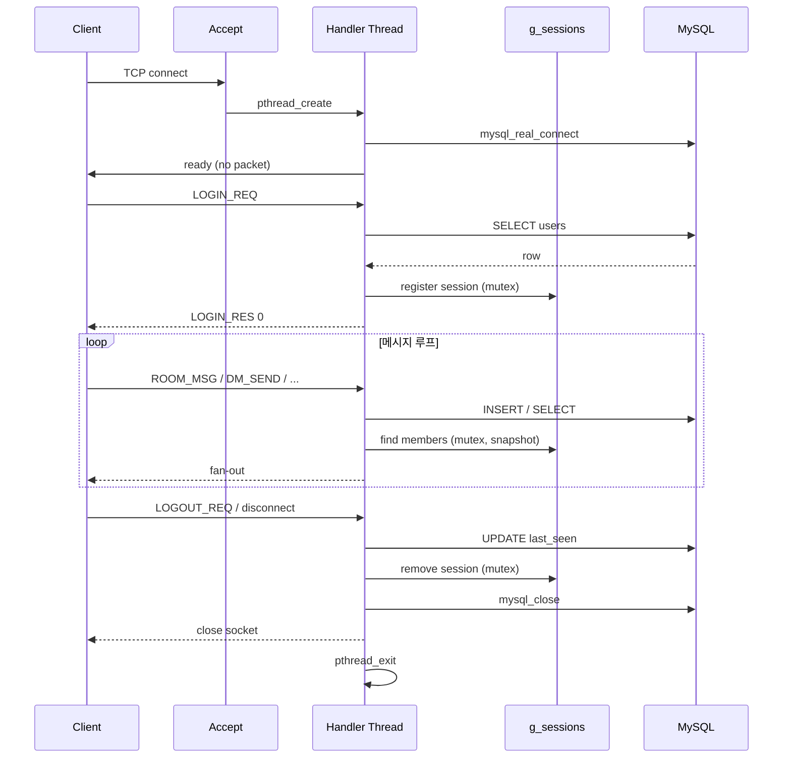
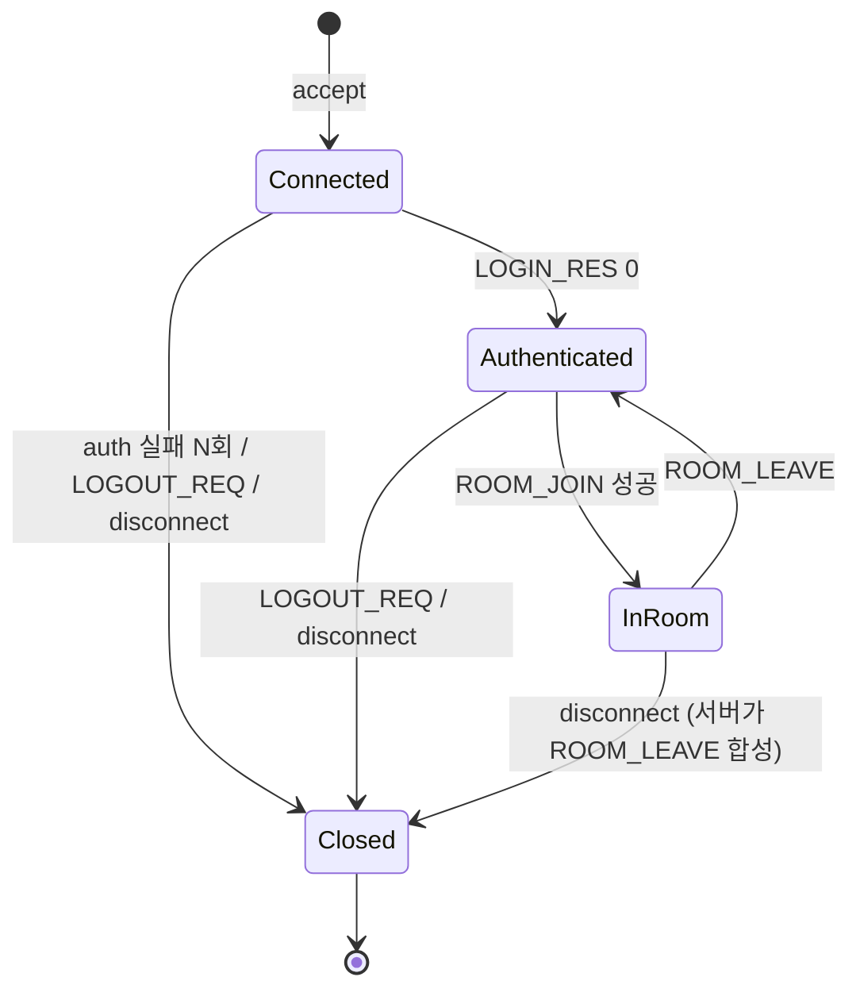

# 세션 수명주기

## 1. 전체 시퀀스

## 2. 상태 전이

## 3. 실패 경로

| 상황 | 처리 |
|------|------|
| `Connected` 에서 60초 내 로그인 없음 | 서버가 소켓 close (DoS 방지) |
| auth 실패 5회 | 소켓 close + 잠시 IP 기록(옵션, P4) |
| `InRoom` 중 연결 끊김 | 핸들러가 `ROOM_LEAVE` 를 합성하여 방에 시스템 메시지 + 세션 정리 |
| DB 연결 끊김 | 3회 재시도. 실패 시 현재 클라이언트만 종료(다른 세션에 영향 없음) |
