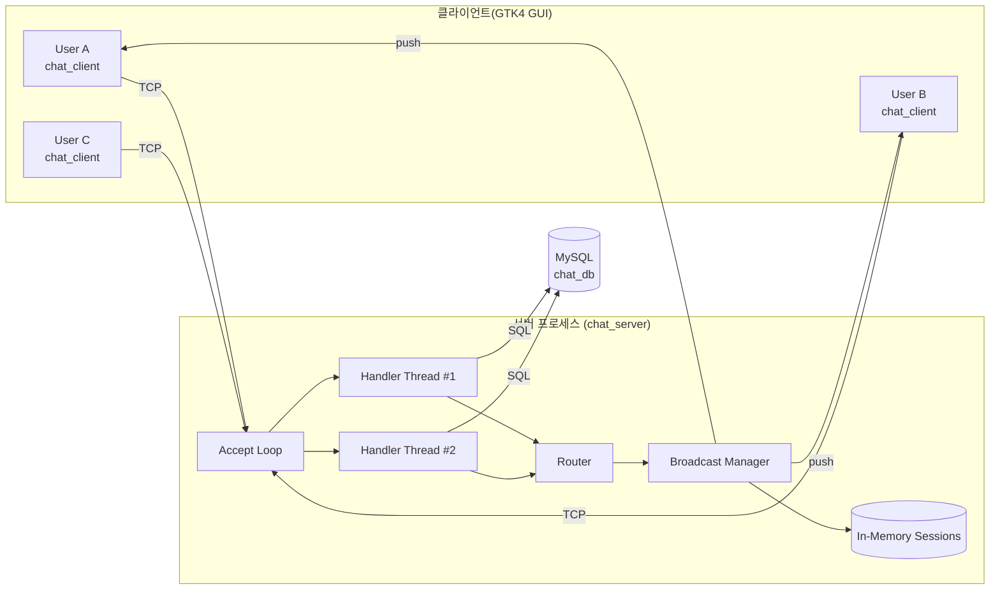

# 시스템 컨텍스트

## 1. 배치도

## 2. 주요 구성 요소

| 요소 | 책임 |
|------|------|
| **chat_server** | 단일 프로세스, 스레드 다수. TCP listen + 핸들러 스폰 + 브로드캐스트. |
| **chat_client** | 단일 프로세스, send/recv 두 스레드 + GTK4 GUI 이벤트 루프. |
| **MySQL** | 유일한 영속 저장소. 스키마는 [`07_database/`](../07_database/). |

## 3. 배포 토폴로지 (예시)

- 개발/학습: 같은 호스트에서 서버 + MySQL + 여러 클라이언트.
- 소규모: MySQL 별도 호스트 + 서버 1대 + 다중 클라이언트.
- 분산은 out-of-scope.

## 4. 외부 의존성

| 의존성 | 용도 |
|--------|------|
| MySQL 5.7+ / 8.x | 영속 저장 |
| libmysqlclient (C API) | 서버측 DB 접근 |
| GTK4 (libgtk-4) | 클라이언트 GUI 위젯 툴킷 |
| pthread | 스레드 |
| 표준 C11 런타임 | 공통 |

서버는 인터넷/외부 API 를 호출하지 않는다.
