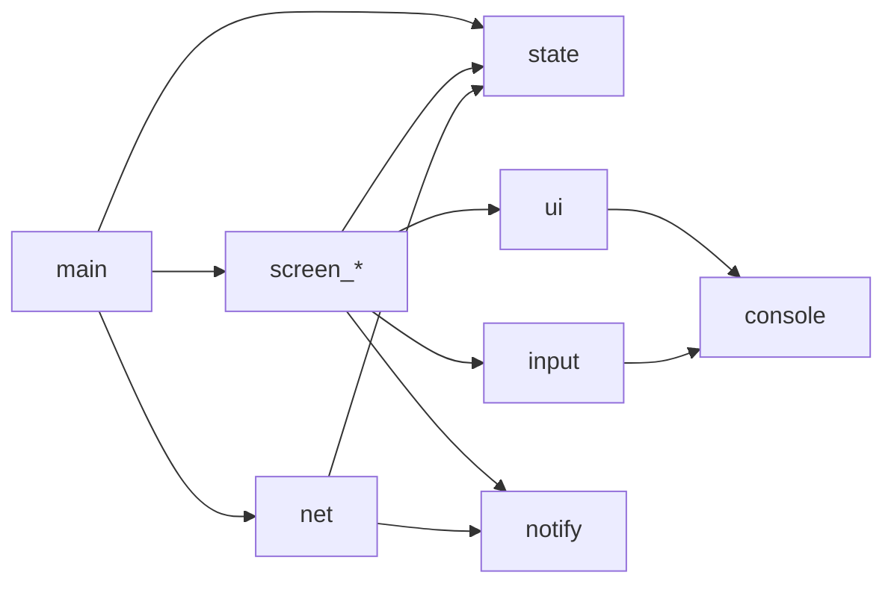

# 클라이언트 모듈

## 파일 목록

| 파일 | 역할 | 주요 심볼 |
|------|------|-----------|
| `main.c` | 인자 파싱, 연결, 화면 루프 진입 | `main`, `main_loop` |
| `state.c/h` | 전역 상태(소켓, 현재 스크린, 내 정보, 설정, 알림 큐) | `g_state`, `state_init`, `state_set_screen` |
| `net.c/h` | 연결, recv 스레드, 스레드 세이프 send | `net_connect`, `net_recv_thread`, `net_send_line` |
| `console.h` | 플랫폼 추상 API | `con_raw_on/off`, `con_getch`, `con_size`, `con_clear`, `con_enable_vt` |
| `console_posix.c` | Linux/macOS 구현 | 위 API 구현 (termios) |
| `console_win.c` | Windows 구현 | 위 API 구현 (Win32) |
| `ui.c/h` | ANSI 색/박스/커서 헬퍼 | `ui_color`, `ui_box`, `ui_move`, `ui_clear_line` |
| `input.c/h` | char 단위 입력 버퍼, 슬래시 커맨드 파서 | `input_feed_char`, `input_flush`, `cmd_parse` |
| `notify.c/h` | 알림 큐·TTL·렌더 | `notify_push`, `notify_tick`, `notify_render` |
| `screen_login.c/h` | 로그인·회원가입 | `screen_login_render`, `screen_login_input` |
| `screen_main.c/h` | 메인 탭 | `screen_main_*` |
| `screen_chat.c/h` | 채팅방 + 메시지 링버퍼 | `screen_chat_*`, `chat_ring_push` |
| `screen_mypage.c/h` | 마이페이지 | `screen_mypage_*` |
| `screen_settings.c/h` | 설정 | `screen_settings_*` |

## 의존성



## 스크린 인터페이스 (권장 시그니처)

```c
typedef struct {
    void (*enter)(void);                   /* 진입 시 1회, 전체 렌더 */
    void (*leave)(void);                   /* 나갈 때 정리 */
    void (*on_key)(int ch);                /* 입력 */
    void (*on_event)(const UiEvent *e);    /* recv 스레드에서 온 이벤트 */
    void (*on_tick)(void);                 /* 주기 호출 (알림 TTL 등) */
} Screen;
```
