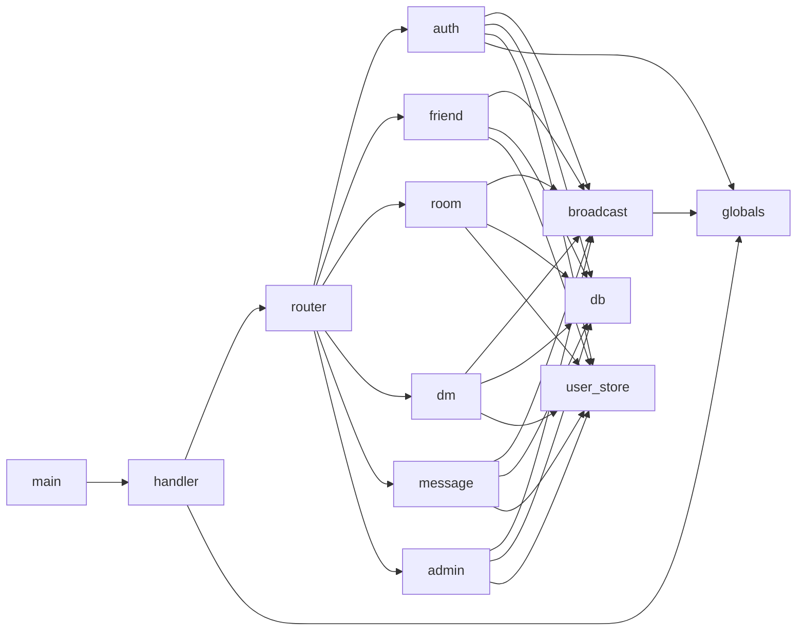

# 서버 모듈

## 파일 목록

| 파일 | 역할 | 주요 심볼 |
|------|------|-----------|
| `main.c` | 진입점, listen/accept, 시그널 | `main`, `accept_loop` |
| `config.h` | 상수(`MAX_CLIENTS`, `DEFAULT_PORT`, DB 접속) | `#define` 전용 |
| `globals.c/h` | 전역 세션 배열, mutex | `g_sessions[]`, `g_sessions_mutex`, `sessions_add`, `sessions_remove`, `sessions_find_by_id`, `sessions_snapshot_room` |
| `client_handler.c/h` | 스레드 본체, 라인 프레이밍 | `client_thread`, `read_line_packet` |
| `router.c/h` | 패킷 TYPE → 핸들러 디스패치 | `router_init`, `router_dispatch` |
| `db.c/h` | MYSQL* 래퍼, prepared stmt 헬퍼 | `db_connect`, `db_close`, `db_exec`, `db_query_row`, `db_query_rows` |
| `auth.c/h` | 회원가입/로그인/로그아웃/PW 변경 | `handle_register`, `handle_login`, `handle_logout`, `handle_pass_change` |
| `user_store.c/h` | 유저/설정 CRUD | `user_exists`, `user_get_profile`, `settings_get`, `settings_update`, `profile_update` |
| `friend.c/h` | 친구 요청/수락/거절/차단/목록/검색 | `handle_friend_*`, `friend_is_blocked` |
| `room.c/h` | 방 CRUD, 입·퇴장, 권한, 공지 | `handle_room_create/join/leave/invite/kick`, `handle_room_set_notice`, `handle_room_grant_admin` |
| `dm.c/h` | DM 송신·히스토리·읽음 | `handle_dm_send`, `handle_dm_history`, `mark_dm_read` |
| `message.c/h` | 삭제/수정/답장/리액션/검색/핀 | `handle_msg_delete/edit/reply/react/search/pin`, `handle_whisper` |
| `broadcast.c/h` | 방/전체 fan-out, 알림 | `bcast_room`, `bcast_all`, `notify_user`, `send_packet_locked` |
| `admin.c/h` | 관리자 명령 | `handle_admin_cmd` |

## 의존성 방향

**규칙**: 하위 계층(`db`, `globals`, `broadcast`)은 상위 계층을 참조하지 않는다.

## 각 `.c` 의 include 정책

- 자신의 `.h` 를 첫 번째로 include.
- `common/protocol.h`, `common/types.h` 는 필요한 곳에서만.
- 플랫폼 헤더는 직접 include 금지 — `common/net_compat.h` 를 경유.
