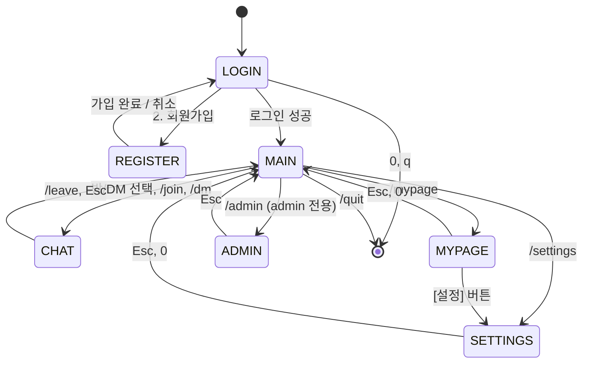

# 화면 흐름

## 1. 최상위 상태 전이



---

## 2. 서브 플로우

### 2-1. 그룹채팅방 생성

```
MAIN
  └─ /room create <이름>  또는  n → [새 채팅] 모달
       │
       ├─ 방 이름 입력 (1~30자)
       ├─ 주제 입력 (선택, 0~100자)
       ├─ 최대 인원 입력 (기본 30)
       ├─ 비밀번호 입력 (선택, 비우면 공개)
       │
       ├─ ROOM_CREATE_RES(OK)  → CHAT (새 방으로 바로 입장)
       └─ ROOM_CREATE_RES(ERR) → 오류 표시 (모달 유지)
```

### 2-2. 오픈채팅방 탐색 & 참여

```
MAIN (오픈채팅 탭)
  └─ 방 목록 또는 검색 결과
       │
       └─ Enter (방 선택)
            │
            ├─ 공개방 → 참여 확인 모달 → ROOM_JOIN
            ├─ 비밀번호 방 → 비밀번호 입력 모달 → ROOM_JOIN
            │                  ├─ 성공 → CHAT
            │                  └─ 실패 → "비밀번호가 맞지 않습니다" 모달 유지
            ├─ 만원 방 → "최대 인원 도달" 모달 → 목록 복귀
            └─ 이미 참여 중 → 바로 CHAT 진입
```

### 2-3. DM 시작

```
MAIN
  ├─ 친구 탭 → 카드 Hover → [DM] 버튼 → CHAT(DM)
  ├─ /dm <id> → DM_HISTORY_REQ → CHAT(DM)
  └─ 채팅 탭 → 기존 DM 선택 → CHAT(DM)
```

### 2-4. 친구 추가 플로우

```
어느 화면에서나:
  /friend add <id>
      │
      ├─ FRIEND_ADD_RES(0=SENT)         → Toast "요청을 보냈습니다"
      ├─ FRIEND_ADD_RES(1=NOT_FOUND)    → Toast "✗ 존재하지 않는 ID"
      ├─ FRIEND_ADD_RES(2=BLOCKED)      → Toast "✗ 차단된 상태입니다"
      └─ FRIEND_ADD_RES(3=ALREADY)      → Toast "✗ 이미 친구입니다"

수신 측 (실시간):
  FRIEND_REQUEST_NOTIFY → Banner "[1 수락] [2 거절]"
      │
      ├─ [1 수락] → FRIEND_ACCEPT → Toast "✓ 친구가 되었습니다"
      ├─ [2 거절] → FRIEND_REJECT → 배너 소멸
      └─ × (보류) → 친구 탭 뱃지 증가, 목록 상단에 보류 섹션 추가
```

### 2-5. 메시지 수정/삭제

```
CHAT
  ├─ /del <msg_id>
  │     └─ 확인 모달 → MSG_DELETE
  │           ├─ OK → 해당 행 "(삭제된 메시지)" 로 교체
  │           └─ ERR → Toast "✗ 삭제할 수 없습니다"
  │
  └─ /edit <msg_id> <내용>
        ├─ 클라이언트: 5분 이내 검사 → 실패 시 즉시 오류 (서버 미전송)
        └─ MSG_EDIT → MSG_EDITED_NOTIFY → 해당 행 "· 수정됨" 추가
```

### 2-6. 답장 (Reply)

```
CHAT
  ├─ /reply <msg_id> <내용>
  └─ r 키 (마지막 메시지에 빠른 답장)
       └─ Composer 위에 인용 프리뷰 표시:
            ╭──────────────────────────────╮
            │ ┊ 홍길동: 과제 다들 했어?    │   ← 40자 truncate
            │                     [취소]  │
            ╰──────────────────────────────╯
          Enter → MSG_REPLY 전송
          Esc   → 답장 취소
```

### 2-7. 리액션 (Reaction)

```
CHAT
  ├─ /react <msg_id> <emoji>
  └─ + 키 (마지막 메시지에 리액션 선택기)
       │
       └─ 리액션 선택기 팝업 (오버레이 z-layer 3):
            ╭──────────────────────────────────────╮
            │  (^_^)  <3   (>_<)  (^o^)  (T_T)   │
            │  :+1:   :ok: :fire: :star: :100:    │
            ╰──────────────────────────────────────╯
          Enter / Space → MSG_REACT 전송 (이미 반응 시 토글/취소)
          Esc   → 취소
```

### 2-8. 멤버 목록 오버레이

```
CHAT
  └─ /members 또는 ⋯ → [멤버]
       └─ 우측 패널 오버레이 열림 (z-layer 1, 화면 우측 1/3)
            ├─ 목록 표시 (방장/관리자/일반 구분)
            ├─ 항목 선택 → 컨텍스트 메뉴 (DM, 초대, 강퇴, 권한부여)
            └─ Esc / 바깥 클릭 → 오버레이 닫힘
```

### 2-9. 메시지 검색 오버레이

```
CHAT
  └─ /search <keyword>
       └─ 상단 오버레이 열림 (TopBar 아래)
            ├─ 검색 결과 목록 표시
            ├─ 항목 선택 → 해당 메시지 위치로 점프 + 하이라이트
            └─ Esc → 오버레이 닫힘, 이전 위치 복귀
```

### 2-10. 프로필 수정 (마이페이지 인라인)

```
MYPAGE
  └─ [프로필 수정]
       ├─ Hero 영역이 인라인 편집 모드 전환
       ├─ Enter → PROFILE_UPDATE → Toast "✓ 저장"
       └─ Esc   → 취소, 원래 값 복귀
```

### 2-11. 비밀번호 변경 (모달)

```
MYPAGE or SETTINGS
  └─ [비밀번호 변경]
       └─ 모달 열림
            ├─ 현재 PW → 새 PW → 확인
            ├─ OK → Toast "✓ 비밀번호가 변경되었습니다"
            └─ ERR → "현재 비밀번호가 맞지 않습니다" (모달 유지)
```

### 2-12. 연결 끊김 & 재연결

```
(모든 화면)
  └─ PONG 미수신 60초
       ├─ 배너(urgent) 표시: "재연결 시도 중... (1/3)"
       ├─ 재시도 5초 간격 3회
       │    ├─ 성공 → 배너 해제, Toast "✓ 다시 연결"
       │    │          → HISTORY_REQ 재발송 (CHAT 중이면)
       │    └─ 실패 → 배너 "[ 재시도 ] [ 종료 ]"
       └─ 수동 [재시도] → 카운터 리셋 후 반복
```

### 2-13. 관리자 플로우

```
MAIN (admin 전용)
  └─ ▤ 관리자 패널 또는 /admin
       ├─ stat       → 서버 현황 탭
       ├─ user_list  → 유저 목록 탭
       │    └─ K (강퇴) → 확인 모달 → ADMIN_CMD(kick_user)
       ├─ room_list  → 채팅방 목록 탭
       │    └─ D (삭제) → 확인 모달 → ADMIN_CMD(delete_room)
       └─ broadcast  → 공지 작성 → 확인 모달 → ADMIN_CMD(broadcast)
```

---

## 3. 공통 키 바인딩

| 키 | 동작 |
|----|------|
| `Enter` | 현재 입력 확정 / 메뉴 선택 |
| `Backspace` | 한 글자 지우기 |
| `Ctrl+U` | 현재 필드 전체 지우기 / 히스토리 추가 로드(CHAT) |
| `Ctrl+C` | 안전 종료 (모든 화면) |
| `Esc` | 뒤로가기 / 오버레이 닫기 / 모달 취소 |
| `Tab` | 메인 사이드바 ↔ 패널 포커스 전환 / 다음 입력 필드 |
| `↑` / `↓` | 메시지 스크롤(CHAT), 목록 이동 |
| `/` | 슬래시 커맨드 모드 진입 (Composer 포커스) |
| `q` | 로그인 화면에서 종료 |

---

## 4. 이벤트 수신 시 화면별 반응

| 이벤트 | LOGIN | MAIN | CHAT(현재 방) | CHAT(타 방) | MYPAGE | SETTINGS | ADMIN |
|--------|:-----:|:----:|:-------------:|:-----------:|:------:|:--------:|:-----:|
| `ROOM_MSG_RECV` (현재 방) | - | 배너 | 메시지 추가 | - | 배너 | 배너 | 배너 |
| `ROOM_MSG_RECV` (타 방) | - | 배너+뱃지 | 배너 | 메시지 추가 | 배너 | 배너 | 배너 |
| `DM_RECV` | - | 배너+뱃지 | 배너 | 배너 | 배너 | 배너 | 배너 |
| `FRIEND_REQUEST_NOTIFY` | - | 배너+뱃지 | 배너 | 배너 | 배너 | 배너 | 배너 |
| `TYPING_NOTIFY` | - | - | 하단 표시 | - | - | - | - |
| `NOTIFY(MENTION)` | - | 배너(urgent) | 배너(urgent) | 배너(urgent) | 배너(urgent) | 배너(urgent) | 배너(urgent) |
| `NOTIFY(SERVER)` | - | 배너(urgent) | 배너(urgent) | 배너(urgent) | 배너(urgent) | 배너(urgent) | 배너(urgent) |
| `FRIEND_STATUS_CHANGE` | - | 친구목록 갱신 | - | - | - | - | - |
| `MSG_REACT_NOTIFY` | - | - | ReactionStrip 갱신 | - | - | - | - |
| `MSG_DELETED_NOTIFY` | - | - | 행 교체 | - | - | - | - |
| `MSG_EDITED_NOTIFY` | - | - | 행 갱신 | - | - | - | - |
| `TYPING_NOTIFY` | - | - | TypingIndicator | - | - | - | - |
| DND ON 중 | - | 멘션만 배너 | 멘션만 배너 | 멘션만 배너 | 멘션만 배너 | 멘션만 배너 | 멘션만 배너 |

"배너" = 상단 알림 배너 큐에 push(최대 3개).  
"배너(urgent)" = DND 무시하고 레벨 2로 표시.

---

## 5. 화면 너비별 레이아웃 전환

| 터미널 너비 | 레이아웃 |
|------------|---------|
| ≥ 100 | 사이드바(26) + 메인 패널 2-pane |
| 80~99 | 사이드바 숨김 → 상단 얇은 탭 바 |
| < 80 | 경고 출력 → 단일 패널(요약 모드) |
| < 24행 | 경고 출력 → 동작 제한 모드 |

`SIGWINCH` 수신 → 크기 재조회 → `render_full`.
