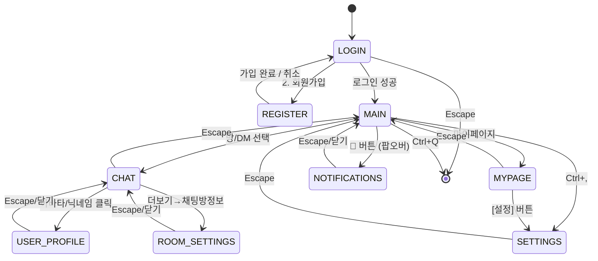

# 화면 흐름

## 1. 최상위 상태 전이



화면 전환은 `GtkStack.set_visible_child_name()` 으로 처리.

---

## 2. 서브 플로우

### 2-1. 그룹채팅방 생성

```
MAIN
  └─ Ctrl+N 또는 "+ 새 채팅" GtkButton → 방 생성 다이얼로그 (GtkWindow)
       │
       ├─ 방 이름 입력 (1~30자)
       ├─ 주제 입력 (선택, 0~100자)
       ├─ 최대 인원 입력 (기본 30)
       ├─ 비밀번호 입력 (선택, 비우면 공개)
       │
       ├─ ROOM_CREATE_RES(OK)  → CHAT (새 방으로 바로 입장)
       └─ ROOM_CREATE_RES(ERR) → 오류 표시 (다이얼로그 유지)
```

### 2-2. 오픈채팅방 탐색 & 참여

```
MAIN (오픈채팅 탭)
  └─ GtkListBox 방 목록 또는 GtkSearchEntry 검색 결과
       │
       └─ 방 카드 클릭 → "참여하기" GtkButton
            │
            ├─ 공개방 → 참여 확인 GtkAlertDialog → ROOM_JOIN
            ├─ 비밀번호 방 → 비밀번호 입력 GtkAlertDialog (GtkEntry) → ROOM_JOIN
            │                  ├─ 성공 → CHAT
            │                  └─ 실패 → "비밀번호가 맞지 않습니다" (다이얼로그 유지)
            ├─ 만원 방 → "최대 인원 도달" GtkAlertDialog → 목록 복귀
            └─ 이미 참여 중 → 바로 CHAT 진입
```

### 2-3. DM 시작

```
MAIN
  ├─ 친구 탭 → 친구 카드 클릭 → GtkButton "DM" → CHAT(DM)
  └─ 채팅 탭 → 기존 DM 선택 → CHAT(DM)
```

### 2-4. 친구 추가 플로우

```
친구 추가 GtkButton → GtkAlertDialog (ID 입력 GtkEntry):
  FRIEND_ADD_RES(0=SENT)         → Toast "요청을 보냈습니다"
  FRIEND_ADD_RES(1=NOT_FOUND)    → Toast "✗ 존재하지 않는 ID"
  FRIEND_ADD_RES(2=BLOCKED)      → Toast "✗ 차단된 상태입니다"
  FRIEND_ADD_RES(3=ALREADY)      → Toast "✗ 이미 친구입니다"

수신 측 (실시간):
  FRIEND_REQUEST_NOTIFY → GtkRevealer 배너 "[수락] [거절]"
       │
       ├─ [수락] → FRIEND_ACCEPT → Toast "✓ 친구가 되었습니다"
       ├─ [거절] → FRIEND_REJECT → 배너 소멸
       └─ × (보류) → 친구 탭 뱃지 증가, 목록 상단에 보류 섹션 추가
```

### 2-5. 메시지 수정/삭제

```
CHAT
  ├─ 메시지 우클릭 → GtkPopoverMenu → 삭제
  │     └─ GtkAlertDialog 확인 → MSG_DELETE
  │           ├─ OK → 해당 행 "(삭제된 메시지)" 로 교체
  │           └─ ERR → Toast "✗ 삭제할 수 없습니다"
  │
  └─ 메시지 우클릭 → GtkPopoverMenu → 수정
        ├─ 클라이언트: 5분 이내 검사 → 실패 시 즉시 오류 (서버 미전송)
        └─ MSG_EDIT → MSG_EDITED_NOTIFY → 해당 행 "· 수정됨" 추가
```

### 2-6. 답장 (Reply)

```
CHAT
  └─ 메시지 우클릭 → GtkPopoverMenu → 답장
       └─ Composer 위 GtkRevealer 슬라이드-인:
            GtkLabel: 원본 발신자 닉네임 + 인용 텍스트 (40자 truncate)
            GtkButton "×": 답장 취소, GtkRevealer 닫기
          Enter → MSG_REPLY 전송
          Escape → 답장 취소
```

### 2-7. 멤버 목록 오버레이

```
CHAT
  └─ GtkHeaderBar의 "멤버" GtkButton
       └─ GtkPopover 또는 우측 GtkBox 패널 표시
            ├─ GtkListBox: 방장/일반 구분 목록
            ├─ 항목 클릭 → GtkPopoverMenu (DM, 귓속말)
            └─ Escape / 바깥 클릭 → 패널 닫힘
```

### 2-8. 메시지 검색 오버레이

```
CHAT
  └─ GtkHeaderBar의 검색 GtkButton → GtkSearchEntry 활성화
       └─ GtkRevealer로 검색 결과 GtkListBox 표시
            ├─ 항목 클릭 → 해당 메시지 위치로 점프 + 하이라이트
            └─ Escape → 검색 닫기, 이전 위치 복귀
```

### 2-9. 프로필 수정 (마이페이지 다이얼로그)

```
MYPAGE
  └─ GtkButton "프로필 수정"
       └─ GtkAlertDialog (닉네임, 상태 메시지 GtkEntry 필드)
            ├─ OK → PROFILE_UPDATE → Toast "✓ 저장"
            └─ 취소 → 다이얼로그 닫기
```

### 2-10. 비밀번호 변경 (다이얼로그)

```
MYPAGE or SETTINGS
  └─ GtkButton "비밀번호 변경"
       └─ GtkAlertDialog 또는 별도 GtkWindow 다이얼로그
            ├─ 현재 PW → 새 PW → 확인 (각 GtkEntry)
            ├─ OK → Toast "✓ 비밀번호가 변경되었습니다"
            └─ ERR → "현재 비밀번호가 맞지 않습니다" (다이얼로그 유지)
```

### 2-11. 연결 끊김 & 재연결

```
(모든 화면)
  └─ PONG 미수신 60초
       ├─ GtkRevealer(urgent) 표시: "재연결 시도 중... (1/3)"
       ├─ 재시도 5초 간격 3회
       │    ├─ 성공 → 배너 해제, Toast "✓ 다시 연결"
       │    │          → HISTORY_REQ 재발송 (CHAT 중이면)
       │    └─ 실패 → GtkButton "재시도" / GtkButton "종료" 표시
       └─ 수동 [재시도] → 카운터 리셋 후 반복
```

### 2-12. 유저 프로필 팝오버

```
CHAT / MAIN (친구탭) / 멤버목록
  └─ 아바타 또는 닉네임 GtkGestureClick (button=PRIMARY)
       └─ USER_VIEW|<id> 전송
            ├─ 응답 전: GtkPopover에 GtkSpinner 표시
            └─ USER_VIEW_RES 수신:
                 └─ GtkPopover 표시 (프로필 카드)
                      ├─ [DM 보내기] → 팝오버 닫기 → DM 채팅 진입
                      ├─ [친구 추가] → FRIEND_ADD 전송 → 버튼 상태 교체
                      ├─ [차단] → GtkAlertDialog 확인 → FRIEND_BLOCK 전송
                      └─ Escape / 외부 클릭 → 팝오버 닫기
```

자기 자신 클릭 → USER_PROFILE 열지 않고 마이페이지 탭으로 이동.

### 2-13. 방 정보 및 설정 패널

```
CHAT
  └─ GtkHeaderBar 더보기 GtkMenuButton → "채팅방 정보" GtkPopoverMenu 항목
       └─ GtkWindow (modal) "채팅방 정보" 표시
            └─ ROOM_INFO|<room_id> + ROOM_MEMBERS|<room_id> 요청
                 ├─ 정보 탭: 방 이름, 주제, 인원, 공지 표시 (읽기 전용)
                 └─ 관리 탭 (방장만 표시):
                      ├─ 방 정보 수정 → ROOM_NOTICE 등 전송
                      ├─ 방 삭제 → GtkAlertDialog 확인
                      │     ├─ [삭제] → ROOM_DELETE 전송
                      │     │         → ROOM_DELETED_NOTIFY → 모든 멤버 MAIN으로 이동
                      │     └─ [취소] → 다이얼로그 닫기
                      └─ Escape → GtkWindow 닫기
```

---

## 3. GTK4 가속키

| 키 | 동작 |
|----|------|
| `Ctrl+Q` | 앱 종료 |
| `Ctrl+,` | 설정 화면 열기 |
| `Ctrl+N` | 새 채팅방 만들기 다이얼로그 |
| `Alt+1` | 메인 친구 탭 |
| `Alt+2` | 메인 채팅 탭 |
| `Alt+3` | 메인 오픈채팅 탭 |
| `Alt+4` | 마이페이지 |
| `Escape` | 뒤로가기 / 오버레이 닫기 / 모달 취소 |
| `Enter` | 현재 입력 확정 / 메시지 전송 |
| `Ctrl+Enter` | 줄바꿈 (멀티라인 Composer) |

가속키는 `gtk_application_set_accels_for_action()` 으로 등록.

---

## 4. 이벤트 수신 시 화면별 반응

| 이벤트 | LOGIN | MAIN | CHAT(현재 방) | CHAT(타 방) | MYPAGE | SETTINGS |
|--------|:-----:|:----:|:-------------:|:-----------:|:------:|:--------:|
| `ROOM_MSG_RECV` (현재 방) | - | 배너 | 메시지 추가 | - | 배너 | 배너 |
| `ROOM_MSG_RECV` (타 방) | - | 배너+뱃지 | 배너 | 메시지 추가 | 배너 | 배너 |
| `DM_RECV` | - | 배너+뱃지 | 배너 | 배너 | 배너 | 배너 |
| `FRIEND_REQUEST_NOTIFY` | - | 배너+뱃지 | 배너 | 배너 | 배너 | 배너 |
| `TYPING_NOTIFY` | - | - | 하단 표시 | - | - | - |
| `NOTIFY(MENTION)` | - | 배너(urgent) | 배너(urgent) | 배너(urgent) | 배너(urgent) | 배너(urgent) |
| `NOTIFY(SERVER)` | - | 배너(urgent) | 배너(urgent) | 배너(urgent) | 배너(urgent) | 배너(urgent) |
| `FRIEND_STATUS_CHANGE` | - | 친구목록 갱신 | - | - | - | - |
| `MSG_DELETED_NOTIFY` | - | - | 행 교체 | - | - | - |
| `MSG_EDITED_NOTIFY` | - | - | 행 갱신 | - | - | - |
| DND ON 중 | - | 멘션만 배너 | 멘션만 배너 | 멘션만 배너 | 멘션만 배너 | 멘션만 배너 |

"배너" = `GtkRevealer` 기반 상단 알림 배너 큐에 push(최대 3개).  
"배너(urgent)" = DND 무시하고 레벨 2로 표시.

모든 UI 업데이트는 recv 스레드에서 `g_idle_add()` 로 GTK 메인 루프에 예약.

---

## 5. 창 크기 반응형 레이아웃

| 창 너비 | 레이아웃 |
|---------|---------|
| ≥ 600px | `GtkPaned`: 사이드바 + 메인 패널 2-pane (사이드바 크기 조절 가능) |
| < 600px | 사이드바 숨김 → 상단 탭 바만 표시 |

`notify::default-width` 시그널로 창 너비 변경 감지. 최소 600px 강제:

```c
g_signal_connect(window, "notify::default-width",
                 G_CALLBACK(on_window_width_changed), NULL);
```
