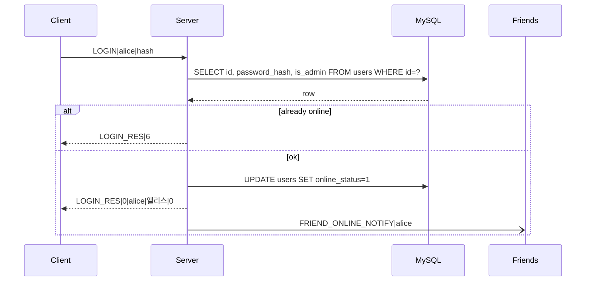
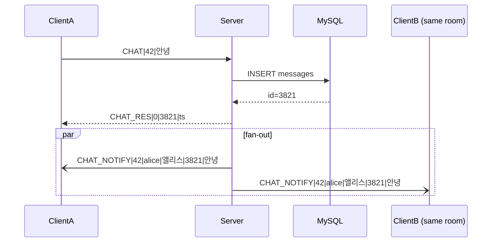
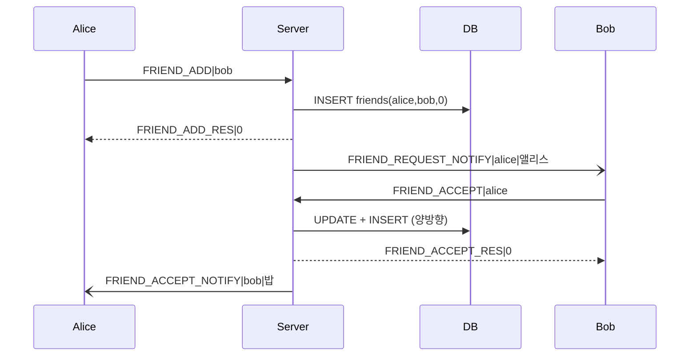
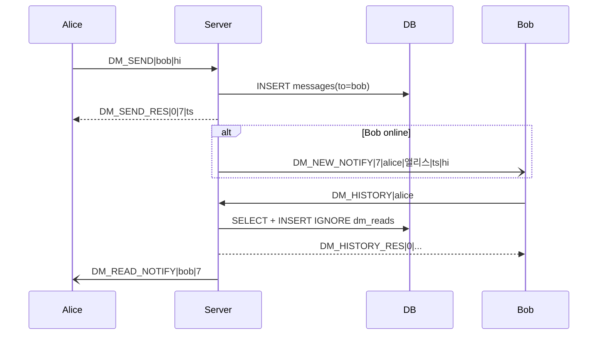
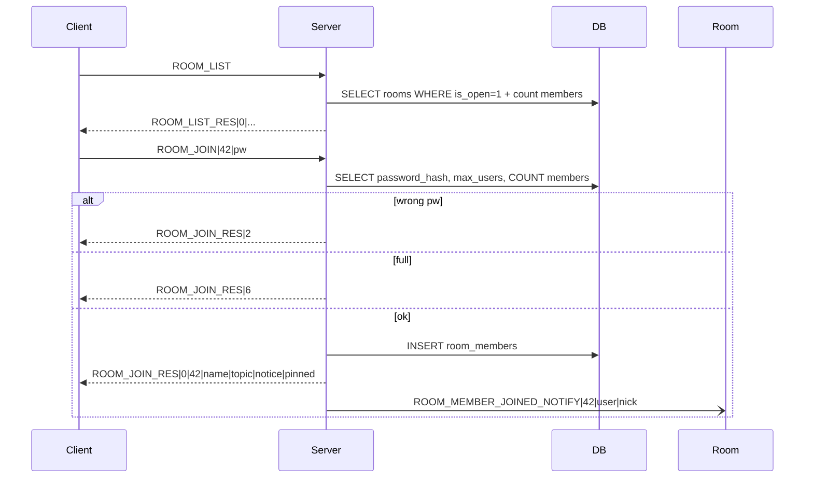
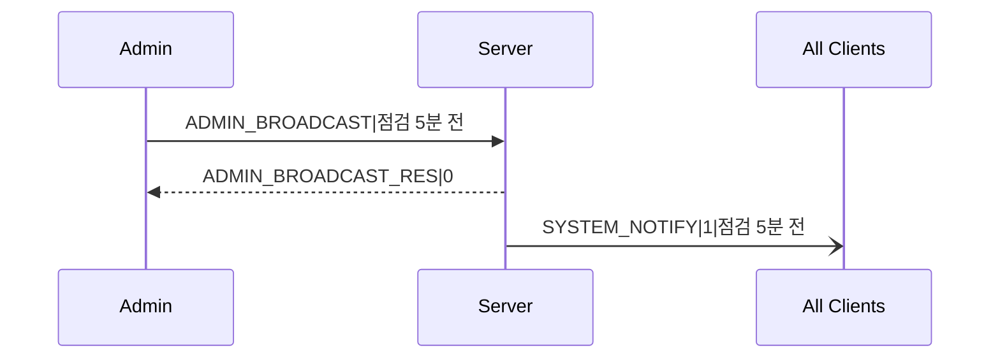

# 시퀀스 다이어그램

## 1. 로그인

```mermaid
sequenceDiagram
    participant C as Client
    participant S as Server
    participant D as MySQL
    C->>S: LOGIN|alice|hash
    S->>D: SELECT id, password_hash, is_admin FROM users WHERE id=?
    D-->>S: row
    alt already online
        S-->>C: LOGIN_RES|6
    else ok
        S->>D: UPDATE users SET online_status=1
        S-->>C: LOGIN_RES|0|alice|앨리스|0
        S-)Friends: FRIEND_ONLINE_NOTIFY|alice
    end
```

## 2. 방 메시지

```mermaid
sequenceDiagram
    participant A as ClientA
    participant S as Server
    participant D as MySQL
    participant B as ClientB (same room)
    A->>S: CHAT|42|안녕
    S->>D: INSERT messages
    D-->>S: id=3821
    S-->>A: CHAT_RES|0|3821|ts
    par fan-out
        S-)A: CHAT_NOTIFY|42|alice|앨리스|3821|안녕
        S-)B: CHAT_NOTIFY|42|alice|앨리스|3821|안녕
    end
```

## 3. 친구 요청 → 수락

```mermaid
sequenceDiagram
    participant A as Alice
    participant S as Server
    participant D as DB
    participant B as Bob
    A->>S: FRIEND_ADD|bob
    S->>D: INSERT friends(alice,bob,0)
    S-->>A: FRIEND_ADD_RES|0
    S-)B: FRIEND_REQUEST_NOTIFY|alice|앨리스
    B->>S: FRIEND_ACCEPT|alice
    S->>D: UPDATE + INSERT (양방향)
    S-->>B: FRIEND_ACCEPT_RES|0
    S-)A: FRIEND_ACCEPT_NOTIFY|bob|밥
```

## 4. DM + 읽음

```mermaid
sequenceDiagram
    participant A as Alice
    participant S as Server
    participant D as DB
    participant B as Bob
    A->>S: DM_SEND|bob|hi
    S->>D: INSERT messages(to=bob)
    S-->>A: DM_SEND_RES|0|7|ts
    alt Bob online
        S-)B: DM_NEW_NOTIFY|7|alice|앨리스|ts|hi
    end
    B->>S: DM_HISTORY|alice
    S->>D: SELECT + INSERT IGNORE dm_reads
    S-->>B: DM_HISTORY_RES|0|...
    S-)A: DM_READ_NOTIFY|bob|7
```

## 5. 오픈방 참여 (비번 방)

```mermaid
sequenceDiagram
    participant C as Client
    participant S as Server
    participant D as DB
    C->>S: ROOM_LIST
    S->>D: SELECT rooms WHERE is_open=1 + count members
    S-->>C: ROOM_LIST_RES|0|...
    C->>S: ROOM_JOIN|42|pw
    S->>D: SELECT password_hash, max_users, COUNT members
    alt wrong pw
        S-->>C: ROOM_JOIN_RES|2
    else full
        S-->>C: ROOM_JOIN_RES|6
    else ok
        S->>D: INSERT room_members
        S-->>C: ROOM_JOIN_RES|0|42|name|topic|notice|pinned
        S-)Room: ROOM_MEMBER_JOINED_NOTIFY|42|user|nick
    end
```

## 6. 서버 종료 → 관리자 브로드캐스트

```mermaid
sequenceDiagram
    participant Adm as Admin
    participant S as Server
    participant All as All Clients
    Adm->>S: ADMIN_BROADCAST|점검 5분 전
    S-->>Adm: ADMIN_BROADCAST_RES|0
    S-)All: SYSTEM_NOTIFY|1|점검 5분 전
```
