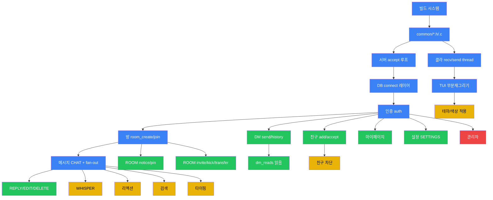

# 의존 그래프

## 구현 순서

## 크로스컷 의존

- 모든 DB 작업 → `07_database/connection_pooling.md` 의 MYSQL* 수명 규칙 준수
- 모든 패킷 파싱 → `08_api/packet_format.md` 검증 선행
- 모든 fan-out → `03_architecture/threading_model.md` 의 mutex 규약 준수
- 모든 권한 작업 → `05_security/authorization.md` 매트릭스 따르기

## 외부 요소

- MySQL 서버 설치 및 `schema.sql` 적용 → P0 의 `DB connect 레이어` 이전 필수.
- Windows MinGW 환경에서는 `libmysqlclient.a` 또는 `mariadb-connector-c` 정적 빌드 사전 준비 필요.
